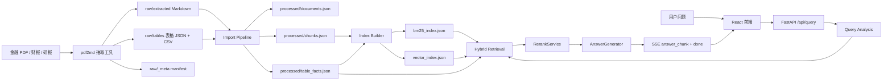
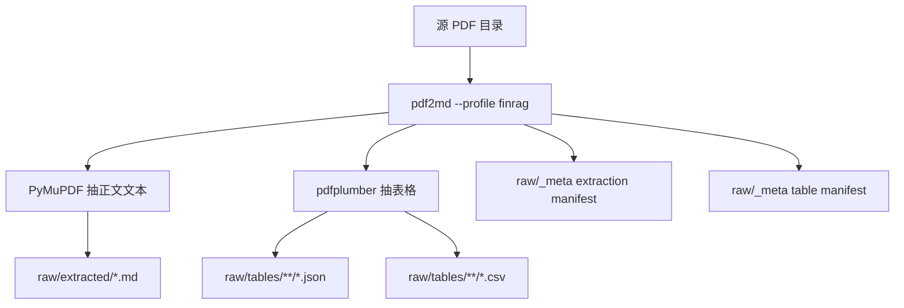
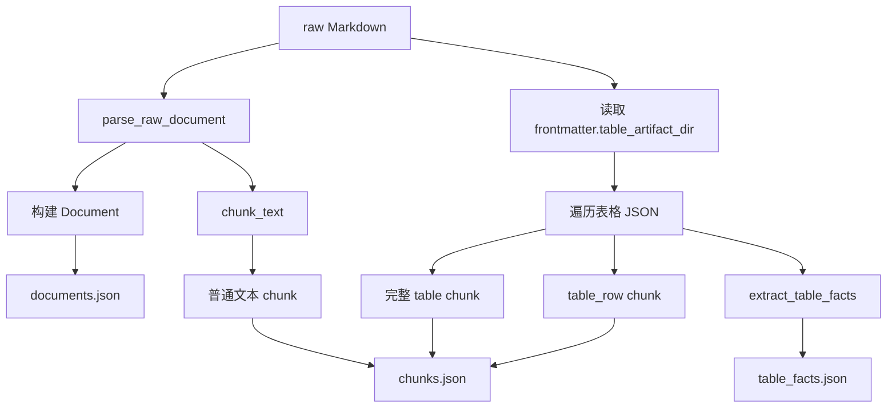
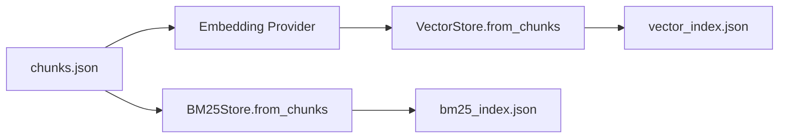
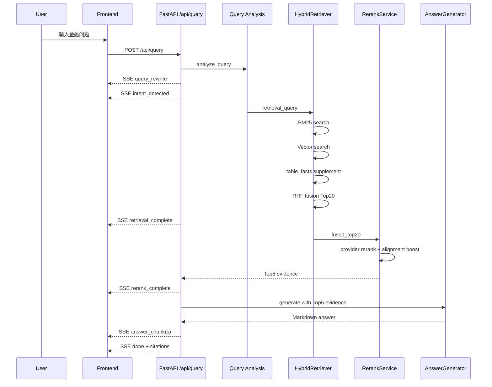
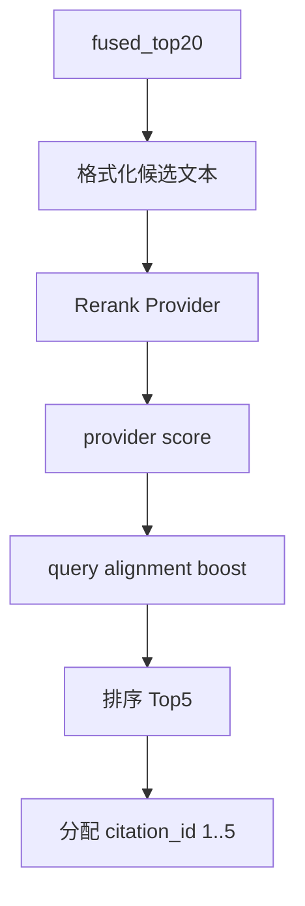

# FinRAG 系统架构与后端设计

## 1. 项目定位

FinRAG 是一个面向金融研究场景的 RAG Agent MVP。它不是通用聊天机器人，而是围绕金融 PDF、财报、研报等资料完成：

- 多源金融文档治理
- PDF 文本层与表格抽取
- 文档切块与本地索引构建
- BM25 + 向量混合检索
- Rerank 精排
- 表格事实问答
- 引用可追溯生成
- SSE 流式输出

系统目标是让用户输入金融研究问题后，获得一份结构化 Markdown 回答，并能看到答案依据来自哪些文档、页码、chunk、表格或表格事实。

---

## 2. 总体架构

前端只承担最小交互职责：发起问题、展示答案流、展示检索过程。核心能力集中在后端和离线数据处理链路。



---

## 3. 后端模块划分

```text
backend/app/
  api/                 FastAPI 路由层
  core/
    agent/             查询分析、Prompt 构建、答案生成工作流
    ingestion/         raw 文档读取、chunking、表格 facts 抽取
    providers/         embedding / rerank / text 模型 provider 抽象
    retrieval/         BM25、向量检索、混合召回、rerank 服务
    sse.py             SSE 事件格式化与 Markdown 分片
  models/              Pydantic schema 和 SSE event 模型
  data/
    raw/               PDF 抽取后的 Markdown、表格 JSON/CSV、manifest
    processed/         documents/chunks/table_facts/kb_state
    index/             BM25 与向量索引
```

### 3.1 API 层

主要路由：

- `GET /health`：健康检查。
- `GET /api/documents`：文档列表。
- `POST /api/query`：核心问答接口，返回 `text/event-stream`。
- `POST /api/debug/retrieval`：调试检索、融合和 rerank 结果。
- `GET /api/kb/overview`：知识库概览。
- `GET /api/kb/documents`：知识库文档列表。
- `POST /api/kb/upload`：上传知识库文件。
- `POST /api/kb/import`：导入 raw 文档到 processed。
- `POST /api/kb/reindex`：重建本地索引。

`/api/query` 是主链路入口，负责串联查询分析、检索、rerank、生成和 SSE 推送。

### 3.2 Ingestion 层

Ingestion 负责把 raw 数据转成 RAG 可用的结构化 JSON。

核心文件：

- `backend/app/core/ingestion/raw_loader.py`
- `backend/app/core/ingestion/chunker.py`
- `backend/app/core/ingestion/corpus_importer.py`
- `backend/app/core/ingestion/table_facts.py`

主要职责：

1. 读取 `raw/extracted/<collection>/*.md` 和 `raw/manual/<collection>/*`。
2. 解析 Markdown frontmatter，保留来源 PDF、页数、hash、表格目录等元数据。
3. 根据 `<!-- page: n -->` 页码 marker 切分正文 chunk。
4. 读取 `raw/tables/<collection>/<pdf-stem>/*.json` 中的表格 Markdown。
5. 把完整表格作为独立 `table` chunk。
6. 把关键财务指标行作为 `table_row` chunk。
7. 从金融表格中抽取结构化 `table_facts`。

---

## 4. 数据治理与 PDF 表格处理

### 4.1 PDF 抽取链路

PDF 抽取由项目内 `pdf2md` 工具完成，输出结果再被后端导入。



正文抽取：

- 使用 PyMuPDF 读取 PDF 文本层。
- 每页前插入 `<!-- page: n -->`，后续 chunk 可继承页码。
- Markdown frontmatter 记录 `source_pdf_name`、`source_pdf_path`、`pdf_sha256`、`text_sha256`、`table_manifest_path`、`table_artifact_dir` 等字段。

表格抽取：

- 使用 `pdfplumber.open(pdf_path)` 打开 PDF。
- 遍历每页 `page.extract_tables()`。
- 把表格转成二维数组。
- 清洗空单元格、空行、空列。
- 第一行作为 `headers`，剩余行作为 `rows`。
- 渲染成 Markdown 表格。
- 每张表保存为一个 JSON 和一个 CSV。

### 4.2 表格 artifact 结构

每张表格 JSON 包含：

```json
{
  "table_id": "tbl-e348d6047ad6-p0005-t01",
  "source_pdf_name": "...pdf",
  "page_num": 5,
  "table_index": 1,
  "headers": ["评级定义", "Column 2"],
  "rows": [["...", "..."]],
  "markdown": "| 评级定义 | Column 2 |\n| --- | --- |\n...",
  "row_count": 10,
  "column_count": 2,
  "extraction_method": "pdfplumber",
  "json_path": "...",
  "csv_path": "..."
}
```

`table_id` 由 PDF 路径 hash、页码和页内表格序号组成，格式为：

```text
tbl-<pdf_path_hash>-p<page_number>-t<table_index>
```

### 4.3 manifest 的作用

系统会生成两类 manifest：

- extraction manifest：记录每个 PDF 是否成功抽取正文、输出 Markdown 路径、页数、字符数和 hash。
- table manifest：记录每个 PDF 的表格抽取状态、表格数量、每张表的页码、行列数、JSON/CSV 路径。

Manifest 不是语义摘要，而是数据治理清单。真正接近“关键财务信息摘要”的结构化数据是 `processed/table_facts.json`。

---

## 5. Import Pipeline 设计



导入后的核心文件：

- `documents.json`：文档级元数据与全文。
- `chunks.json`：普通文本 chunk、完整表格 chunk、表格行 chunk。
- `table_facts.json`：从财务表格中抽出的结构化事实。
- `kb_state.json`：知识库集合、文档状态等管理信息。

### 5.1 Chunk 类型

常见 chunk 类型：

- 普通文本 chunk：来自 PDF/Markdown 正文。
- `table`：完整 Markdown 表格，适合需要上下文的表格检索。
- `table_row`：关键财务指标行，适合营收、净利润、EPS 等问题。
- `table_fact`：查询时从 `table_facts.json` 动态补充的结构化事实候选。

### 5.2 表格 facts 抽取

`table_facts.json` 的目标是提升数值类金融问答的精确度。

抽取逻辑：

1. 判断表格是否包含核心财务指标关键词。
2. 遍历表格行，识别指标名。
3. 解析数字单元格。
4. 根据表头和上下文推断期间。
5. 写入 `metric`、`metric_label`、`period_label`、`raw_value`、`value`、`unit`、`currency`、`page_num`、`table_json_path` 等字段。

示例：

```json
{
  "metric": "revenue",
  "metric_label": "营业收入（千元）",
  "period_label": "2024年",
  "raw_value": "362,012,554",
  "value": 362012554,
  "currency": "CNY",
  "table_json_path": ".../tbl-xxx.json"
}
```

---

## 6. 索引构建与存储



索引由 `RetrievalIndexStore` 统一加载或构建：

- BM25：基于 `jieba` 分词和 `rank_bm25`，保存为 `bm25_index.json`。
- 向量索引：通过 embedding provider 生成 chunk embedding，保存为 `vector_index.json`。
- 如果索引文件不存在或触发重建，会从 active chunks 重新构建。

Provider 通过配置切换：

- `mock`：测试、本地无模型演示。
- `bailian`：阿里云百炼。
- `silicon`：硅基流动，主要用于 embedding/rerank。

---

## 7. 查询问答主链路



### 7.1 Query Analysis

查询分析负责：

- 保留原始问题。
- 扩展公司别名和关键词。
- 构造少量 sub-query。
- 判断意图类型：`factual`、`analytical`、`reasoning`。

意图会影响后续生成 Prompt 的结构。

### 7.2 Hybrid Retrieval

混合检索由 `HybridRetriever` 负责，输入查询后输出：

- `bm25_results`
- `vector_results`
- `fused_top20`

核心策略：

- BM25 负责关键词、公司名、指标名等精确召回。
- Vector 负责语义相似召回。
- Table facts 对营收、净利润等数值问题提供结构化补充候选。
- RRF 将多路结果融合成 Top20。
- 针对公司、指标、期间、表格事实有少量金融场景 boost。

### 7.3 Rerank

RerankService 接收 fused Top20，输出 Top5 evidence。



注意：前端展示的 `Rerank xx` 是 rerank 阶段用于排序的分数。当前实现会在 provider 分数基础上叠加查询对齐 boost，因此它不是纯模型裸分。

如果 rerank provider 失败，系统降级为 hybrid fusion Top5，并在事件里标记：

- `degraded = true`
- `score_source = hybrid_fusion`
- `fallback_reason = ...`

### 7.4 Answer Generation

AnswerGenerator 做三件事：

1. 根据 query、intent、Top5 evidence 构造 Prompt。
2. 调用 text provider 生成 Markdown 回答。
3. 如果模型调用失败或空返回，使用 mock fallback 生成可解释回答。

引用格式使用：

```html
<span class="cite" data-id="1">[1]</span>
```

`citation_id` 与 rerank Top5 的 rank 对齐，因此前端可以从答案中的 `[1]` 回溯到对应 evidence。

---

## 8. SSE 事件设计

`POST /api/query` 返回 `text/event-stream`。事件顺序如下：

```text
query_rewrite
intent_detected
retrieval_complete
rerank_complete
ping
answer_chunk ...
done
```

各事件职责：

- `query_rewrite`：展示原问题、扩展词、sub-query。
- `intent_detected`：展示问题类型和生成模板。
- `retrieval_complete`：展示 BM25、Vector、融合结果。
- `rerank_complete`：展示 Top5 evidence 和 rerank/降级状态。
- `answer_chunk`：流式输出 Markdown 回答片段。
- `done`：输出延迟、估算 token、citation metadata。
- `error`：异常时返回错误码和消息。

这种设计让前端能边回答边展示 RAG 内部过程，便于演示和 debug。

---

## 9. 前端最小职责

前端不是本项目重点，主要承担展示层：

- 左侧：文档库、示例问题、知识库管理入口。
- 中间：问题输入、Markdown 答案流、citation 点击。
- 右侧：BM25、Vector、Rerank Top5 可视化。

前端不做检索、不做 rerank、不做生成。它只消费后端 SSE 事件并渲染状态。

---

## 10. 可靠性与降级设计

系统围绕演示稳定性设计了多层 fallback：

- Provider 抽象：embedding、rerank、text 都可以在 mock/bailian/silicon 间切换。
- Rerank 降级：rerank provider 失败时使用 hybrid fusion Top5。
- 生成降级：text provider 失败或空回答时使用 mock answer。
- 索引兜底：索引不存在时从 chunks 自动构建。
- Import 防护：没有 raw input 时不会覆盖 processed corpus。
- Manifest 审计：PDF 抽取成功、失败、跳过均有记录。

---

## 11. 当前边界与可扩展方向

当前 MVP 的边界：

- PDF 主要面向有文本层的文档，不包含 OCR 扫描件处理。
- 表格抽取依赖 pdfplumber，对复杂跨页表、多级表头、合并单元格不是强保证。
- Rerank Top5 是证据集合，不是最终答案；线上不会再跑 MRR，MRR 更适合离线评测。
- 前端 evidence 展示偏摘要化，完整 chunk 展示仍可增强。

后续可扩展方向：

- 引入 OCR 和版面模型处理扫描 PDF。
- 对复杂财务表做多级表头归一化。
- 建立离线评测集，计算 Recall@K、MRR、nDCG。
- 把核心表格事实落到 SQLite/DuckDB，增强数值查询能力。
- 增加 per-collection 索引隔离和权限控制。

---

## 12. 一句话总结

FinRAG 的后端核心是一条可解释、可降级、可追溯的金融 RAG 链路：先把 PDF 治理成 Markdown、表格 JSON/CSV 和结构化 table facts，再用 BM25、向量和表格事实做混合召回，经过 rerank 得到 Top5 证据，最后由 LLM 基于证据生成带引用的 Markdown 回答，并通过 SSE 把全过程透明地推给前端。
